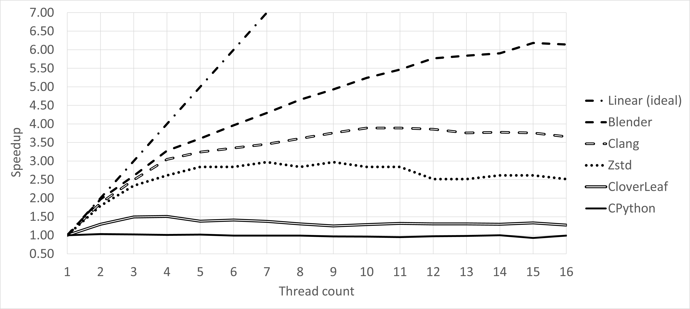
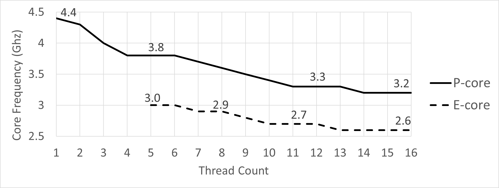
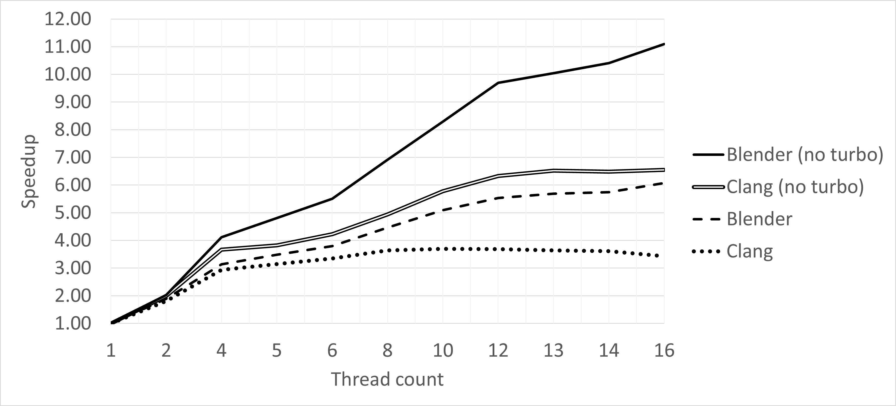

## Core Count Scaling Case Study

Core count scaling is perhaps the most valuable analysis you can perform on a multithreaded application. It shows how well the application can utilize modern multicore systems. As you will see, there is a ton of information you can learn along the way. Without further introduction, let's get started. In this case study, we will analyze the core count scaling of the following benchmarks, some of them should be already familiar to you from the previous chapters:

1. Blender 3.4 - an open-source 3D creation and modeling software project. This test is of Blender's Cycles performance with the BMW27 blend file. URL: [https://download.blender.org/release](https://download.blender.org/release). Command line: `./blender -b bmw27_cpu.blend -noaudio --enable-autoexec -o output.test -x 1 -F JPEG -f 1 -t N`, where `N` is the number of threads.
2. Clang 15 selfbuild - this test uses clang 15 to build clang 15 compiler from sources. URL: [https://www.llvm.org](https://www.llvm.org). Command line: `ninja -jN clang`, where `N` is the number of threads.
3. Zstandard v1.5.5, a fast lossless compression algorithm. URL: [https://github.com/facebook/zstd](https://github.com/facebook/zstd). A dataset used for compression: [http://wanos.co/assets/silesia.tar](http://wanos.co/assets/silesia.tar). Command line: `./zstd -TN -3 -f -- silesia.tar`, where `N` is the number of compression worker threads.
4. CloverLeaf 2018 - a Lagrangian-Eulerian hydrodynamics benchmark. All HW threads are used. This test uses clover_bm.in input file (Problem 5). URL: [http://uk-mac.github.io/CloverLeaf](http://uk-mac.github.io/CloverLeaf). Command line: `export OMP_NUM_THREADS=N; ./clover_leaf`, where `N` is the number of threads.
5. CPython 3.12, a reference implementation of the Python programming language. URL: [https://github.com/python/cpython](https://github.com/python/cpython). A simple multithreaded binary search script, which searches `10'000` random numbers in a sorted list of `1'000'000` elements. Command line: `./python3 binary_search.py N`, where `N` is the number of threads.

The benchmarks were executed on a machine with the configuration shown below:
* 12th Gen Alderlake Intel(R) Core(TM) i7-1260P CPU @ 2.10GHz (4.70GHz Turbo), 4P+8E cores, 18MB L3-cache
* 16 GB RAM, DDR4 @ 2400 MT/s
* Clang 15 compiler with the following options: `-O3 -march=core-avx2`
* 256GB NVMe PCIe M.2 SSD
* 64-bit Ubuntu 22.04.1 LTS (Jammy Jellyfish)

This is clearly not the top-of-the-line hardware setup, but rather a mainstream computer, not necessarily designed to handle media, developer, or HPC workloads. However, for our case study, it is excellent platform to demonstrate the various effects of core count scaling. Because of the limited resources, applications start to hit performance roadblocks even with a small number of threads. Keep in mind, that on better hardware, the scaling results will be different.

Our processor has four P-cores and eight E-cores. P-cores are SMT-enabled, which means the total number of threads on this platform is sixteen. By default, Linux scheduler will first try to use idle physical P-cores. The first four threads will utilize four threads on four idle P-cores. When they are fully utilized, it will start to schedule threads on E-cores. So, the next eight threads will be scheduled on eight E-cores. Finally, the remaining four threads will be scheduled on the 4 sibling SMT threads of P-cores. For our case study, we've also ran the benchmarks while affinitizing threads using the aformentioned scheme, except `Zstd` and `CPython`. Results came out very similar. Running without affinity does a better job of representing real world scenarios, however, thread affinity makes core count scaling analysis more clean, so we present the results when thread affinity is used.

The benchmarks do fixed amount of work. The number of retired instructions is almost identical regardless of the core count.In all of them, the largest portion of an algorithm is implemented using divide-and-conquer paradigm, where work is split into equal parts, and each part can be processed independently. In theory, this allows applications to scale well with the number of cores. However, in practice, the scaling is not perfect. 

Figure @fig:ScalabilityMainChart shows the thread count scalability of the selected benchmarks. The x-axis represents the number of threads, and the y-axis shows the speedup relative to the single-threaded execution. The speedup is calculated as the execution time of the single-threaded execution divided by the execution time of the multi-threaded execution. The higher the speedup, the better the application scales with the number of threads. 

{#fig:ScalabilityMainChart width=100%}

As you can see, most of them are very far from the linear scaling, which is quite disappointing. The benchmark with the best scaling in this case study, Blender, achieves only 6x speedup while using 16x threads. CPython, for examples sees no core count scaling at all. Performance of Clang and Zstd suddenly degrades when the number of threads goes beyond 11. To understand this and other issues, let's dive into the details of each benchmark.

### Blender {.unlisted .unnumbered}

Blender is the only benchmark in our suite that continues to scale up to all 16 threads in the system. The reason for this is that the workload is highly parallelizable. The rendering process is divided into small tiles, and each tile can be rendered independently. However, even with this high level of parallelism, the scaling is only `6.1x speedup / 16 threads = 38%`. What are the reasons for this suboptimal scaling?

From [@sec:PerfMetricsCaseStudy], we know that Blender's performance is bounded by floating point computations. It has relatively high percentage of SIMD instructions as well. P-cores are much better at handling such instructions than E-cores. This is why we see the slope of the speedup curve decrease after 4 threads. After that, scaling continues at the same pace until 12 threads, where it starts to degrade again. This is the effect of using SMT sibling threads. Two active sibling SMT threads compete for the limited number of FP/SIMD execution units. To measure SMT scaling, we need to divide performance of two SMT threads (2T1C - two threads one core) by performance of a single P-core (1T1C), also `4T2C/2T2C`, `6T3C/3T3C`, and so on. For Blender, SMT scaling is around `1.3x` in all configurations. Obviously, this is not a perfect scaling, but still, using sibling SMT threads on P-cores provide performance boost for this workload.

There is another aspect of scaling degradation which we will talk about later.

### Clang {.unlisted .unnumbered}

Similar to Blender, we recommend you to revisit [@sec:PerfMetricsCaseStudy] for an overview of Clang compiler performance bottlenecks. In short, it has a large codebase, flat profile, many small functions, and "branchy" code. Its performance is affected by data cache and TLB misses, and branch mispredictions. It is largely affected by the same scaling issues as Blender: P-cores are more effective than E-cores, and P-core SMT scaling is about `1.1x`. But notice that scaling stops around 10 threads, and actually starts to degrade. Let's understand why that happens.

The problem is related to the frequency throttling. When multiple cores are utilized simultaneously, the processor generates more heat due to the increased workload on each core. To prevent overheating and maintain stability, CPUs often throttle down their clock speeds depending on how many cores are in use. Additionally, boosting all cores to their maximum turbo frequency simultaneously would require significantly more power, which might exceed the power delivery capabilities of the CPU. Our system doesn't posses advanced liquid cooling solution, and only has a single processor fan.

Figure @fig:FrequencyThrotlingClang shows the CPU frequency throttling on our platform while running Clang. Notice that sustained frequency starts to decline starting from a scenario when two P-cores are used simultaneously. By the time you start using all 16 threads, the frequency of P-cores is throttled down to `3.2GHz`, while E-cores operate at `2.6GHz`. We used Intel Vtune's platform view to visualize CPU frequency as shown in [@sec:IntelVtuneOverview]. 

{#fig:FrequencyThrotlingClang width=100%}

Such frequency chart may be used as a first approximation to understand the throttling that occurs on your platform. However, it cannot be automatically applied to all the workloads. Applications that heavily use SIMD instructions typically operate on lower frequencies, so Blender, for example, may see slightly more frequency throttling than Clang.

To confirm that frequency throttling is one of the main reasons for performance degradation, we temporarily disabled Turbo Boost on our platform and redo the scaling study. When Turbo Boost is disabled, all cores operate on their base frequencies, which are `2.1Ghz` for P-cores and `1.5Ghz` for E-cores. The results are shown in Figure @fig:ScalabilityNoTurboChart. As you can see, thread count scaling almost doubles when and 16 threads are used and TurboBoost is disabled, for both Blender (`38%->69%`) and Clang (`21%->41%`). It gives us an intuition of what the thread count scaling would look like if frequency throttling would not exist. In fact, frequency throttling accounts for a large portion of nonrealized performance scaling in modern systems.

{#fig:ScalabilityNoTurboChart width=100%}

Going back to the main chart shown in Figure fig:ScalabilityMainChart, for the Clang workload, the tipping point of performance scaling is around 10 threads. This is the point where the frequency throttling starts to have a significant impact on performance. The benefit of adding additional threads is smaller than the penalty of running at a lower frequency.

### Zstd {.unlisted .unnumbered}

  redo full scalability study with affinity
  [DONE] check how to set the number of worker threads
  [DONE] do HT scalability study
  check profiles 1T vs. 2T vs. 4T vs. 16T - prove that threads are waiting on locks or something else?
  Would I see retrograde speedup?

  When compressing data, Zstd divides the input into blocks, and each block can be compressed independently. This means that multiple threads can work on compressing different blocks simultaneously, speeding up the overall compression process.

### CloverLeaf {.unlisted .unnumbered}

  remeasure 9t - there was a bug in the script.
  [DONE] redo full scalability study with affinity
  [DONE] do HT scalability study
  [DONE] check profile 1T vs. 2T vs. 4T vs. 16T - prove that mem BW is saturated.
  Describe experiments with better memory speed.
  Why there is a drop from 4T -> 5T ? Are E-cores are slow or this is a beginning of thermal issue.

Interestingly, for CloverLeaf, TurboBoost doesn't provide any performance benefit when all 16 threads are used. That means that performance is the same regardless you enable Turbo or let the cores run on their base frequency. How is that possible? The reason is that having 16 active threads is enough to saturate two memory controllers. Since most of the time threads are just waiting for data, when you disable Turbo, they simply start to wait "slower". This is why performance is the same regardless of the frequency.

### CPython {.unlisted .unnumbered}

[TODO]:
Check clang SMT speedup on a single core.
[DONE] Build a frequency chart
[DONE] I see perf drop with many cores -- probably because the CPU cannot sustain frequency. Redo scaling studies with Turbo turned off. 
[DONE] Redo scaling studies with affinity - otherwise instructions on E-cores look very suspicious. And just to ensure no migration.
[TODO]: Find a candidate with almost perfect scaling. - maybe hard to do due to thermal issue on my platform.
