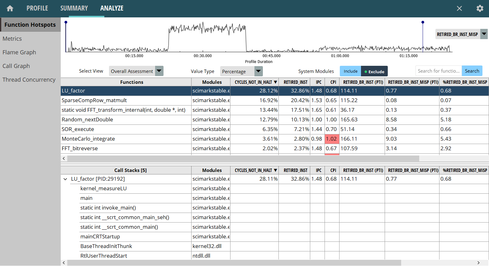

## AMD uProf

The [uProf](https://www.amd.com/en/developer/uprof.html) profiler is a tool developed by AMD for monitoring performance of applications running on AMD processors. While uProf can be used on Intel processors as well, you will be able to use only CPU-independent features. The profiler is available for free to download and can be used on Windows, Linux and FreeBSD. Also, uProf supports analyzing applications written in various languages, including C, C++, Java, .NET/CLR.

It supports CPU performance profiling, OS event tracing, OpenMP tracing, MPI tracing, CPU power profiling.

For CPU performance profiling it uses the sampling method to collect the performance data for analysis. uProf collects two types of MSRs supported by AMD processors to monitor the performance - Core PMC, and IBS (Instruction Based Sampling). IBS MSRs provide precise samples, whereas PMC MSRs suffer with skid issue.

In OS tracing, uProf can monitor various OS events on Linux - thread state, thread synchronization, system calls, page fault, function count, memory trace.

It supports analysis of OpenMP applications to detect thread imbalance, analysis of MPI applications to detect the load imbalance among the nodes of MPI cluster.

It supports profiling on multiple virtual machines (VMs), all features might not be available on all VMs - Microsoft Hyper-V, KVM, VMware ESXi, Citrix Xen.

More details on various features of uProf can be found in the [User Guide](https://www.amd.com/en/developer/uprof.html#documentation).

### How to configure it {.unlisted .unnumbered}

On Linux, uProf uses Linux perf for data collection. On Windows, uProf uses its own driver that gets installed when you install uProf. No additional configuration is required. AMD uProf supports both command-line interface (CLI) and graphical interface (GUI). The CLI interface requires two separte steps - collect and report.

### What you can do with it: {.unlisted .unnumbered}

- find hotspots: functions, statements, instructions.
- monitor various performance events and locate lines of code where these events happen.
- filter data for a specific function or thread.
- observe the workload bahavior over time - view various performance events, OS events, thread states in timeline chart.
- analyze hot callpaths: call-graph, flame-graph and bottom-up charts.
- analyze threads: thread concurrency, load imbalance, etc.

### What you cannot do with it: {.unlisted .unnumbered}

Due to the sampling nature of the tool, it will eventually miss events with a very short duration. The reported samples are statistically estimated numbers, which are most of the time sufficient to analyze the performance but not the exact count of the events.

### Examples {.unlisted .unnumbered}

Figure @fig:uProfHotspots shows the function hotpots analysis. 

At the top of the image, you can see event timeline which shows the number of events observed at various times of the application execution. Metric selection and Process selection, time range selection filters are provided to analyze the different timelines. Below the timeline graph, you can see a list of hot functions table of the selected process along with corresponding metrices or event samples. Below the functions table, you can see bootom-up callstack view for the selected funtion in the functions table.

{#fig:uProfHotspots width=100% }

If you double-click on any function, uProf will open the source view for that function as shown on the figure @fig:uProfSourceView. The heatmap bar on the left makes it eaiser to navigate to the hot statements. Top panel shows the source code and corresponding metrics to each line of code. Bottom panel shows the assembly instructions along with the metrics attributed to those. Highlighted assembly instructions correspond to the selected line in the top panel.

{#fig:uProfSourceView width=100% }

Another useful view for analysis is flame-graph as shown in the figure @fig:uProfFlamegraph. In the figure, each rectangle represents a function call, the width of the rentangle indicates the releative execution time taken by the function itself and by the functions call by it. The function calls happen from bottom to the top.

{#fig:uProfFlamegraph width=100% }

Most of the views provide provide filters to: choose process/thread, select the metric, view metrics as: sample count, raw-event count, percentage. uProf supports various other views: Summary view, Metrics view, Callgraph view, Thread Concurrency view. Readers can experiment and look at those views on their own.